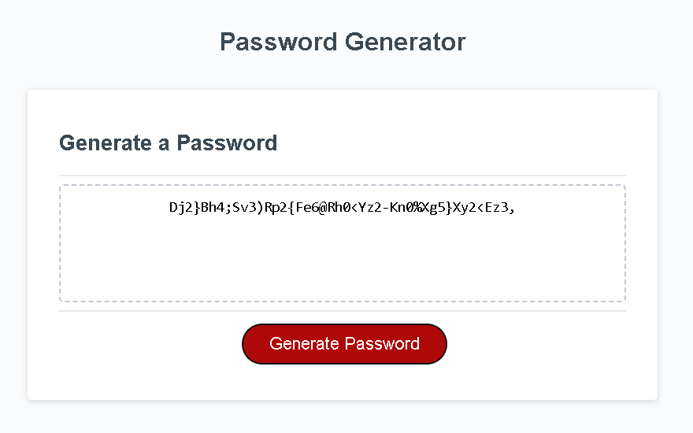
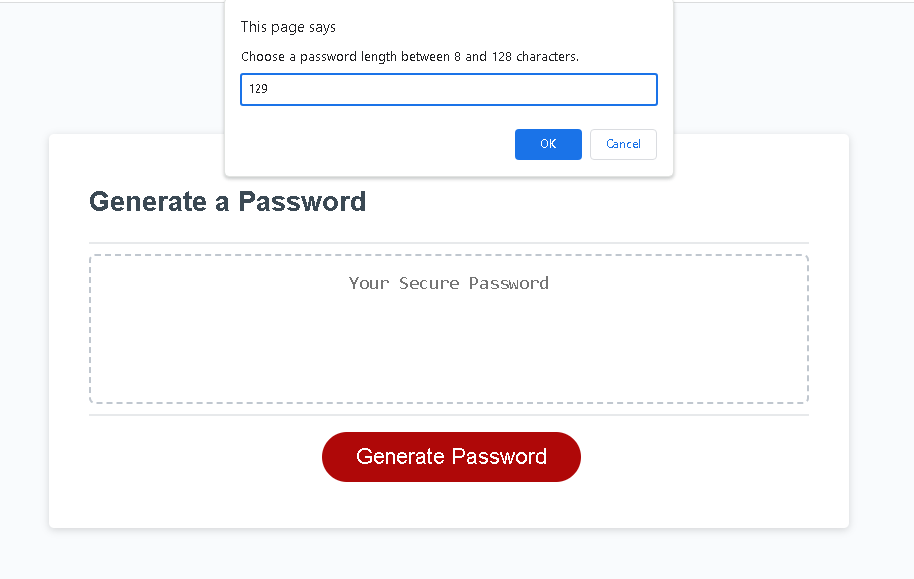
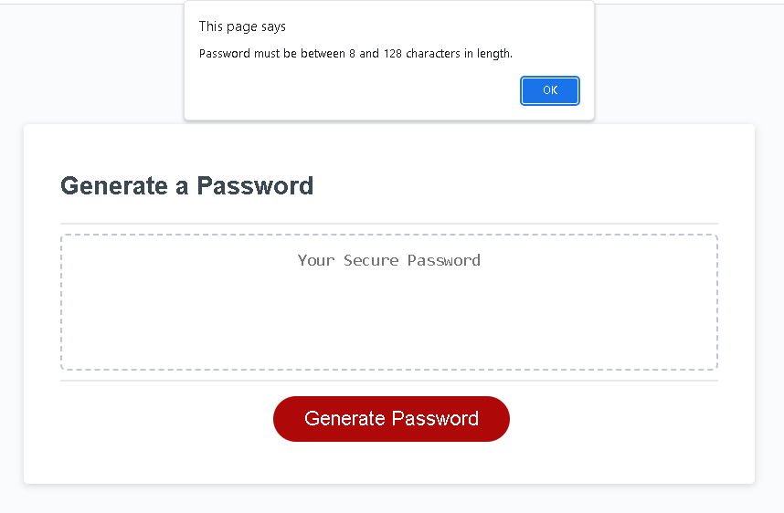

# password-generator
The password generator will generate a password with the size and content you specify.

## Description
This password generator will prompt you for the following to generate a password:

How many characters would you like in your password (min = 8; max = 128)?
Would you like uppercase letters in your password?
Would you like lowercase letters in your password?
Would you like single-digit numbers in your password?
Would you like special characters in your password?

Given this information, the password generator will generate a password of your specified length with letters, numbers and special characters randomly generated and built into your password. The password will be output to your screen.

## User Story
AS AN employee with access to sensitive data

I WANT to randomly generate a password that meets certain criteria

SO THAT I can create a strong password that provides greater security

### Acceptance Criteria
GIVEN I need a new, secure password

WHEN I click the button to generate a password

THEN I am presented with a series of prompts for password criteria

WHEN prompted for password criteria

THEN I select which criteria to include in the password

WHEN prompted for the length of the password

THEN I choose a length of at least 8 characters and no more than 128 characters

WHEN asked for character types to include in the password

THEN I confirm whether or not to include lowercase, uppercase, numeric, and/or special characters

WHEN I answer each prompt

THEN my input should be validated and at least one character type should be selected

WHEN all prompts are answered

THEN a password is generated that matches the selected criteria

WHEN the password is generated

THEN the password is either displayed in an alert or written to the page

### Mock Up
Screenshot of the website with a password generated.

Example of prompt.

Example of an alert.

## Installation/Execution
https://vdunlop.github.io/password-generator/

The password generator has a button that will need to be pushed to start the process. After you click on the button labeled "Generate Password", you will be prompted for password requirements.

Password Length - password length must be a number between 8 and 128. If you enter a number out of bounds, you will receive an alert and you will need to start over.

Prompt for Uppercase Letter Inclusion - this prompt requires an answer of 'y', 'Y', 'n', or 'N'. If you specify a different value or no value, you will receive an alert and you will need to start over.

Prompt for Lowercase Letter Inclusion - this prompt requires an answer of 'y', 'Y', 'n', or 'N'. If you specify a different value or no value, you will receive an alert and you will need to start over.

Prompt for Single-digit Number Inclusion - this prompt requires an answer of 'y', 'Y', 'n', or 'N'. If you specify a different value or no value, you will receive an alert and you will need to start over.

Prompt for Special Character Inclusion - this prompt requires an answer of 'y', 'Y', 'n', or 'N'. If you specify a different value or no value, you will receive an alert and you will need to start over.

The generated password will include characters of the types above that you respond 'y' or 'Y' to. If you respond 'n' or 'N' to all prompts, you will receive an alert and you will need to start over.

## Usage
When you open the password generator window, you will be able to click on the "Generate Password" button to design and generate a password that is based on random number generation to choose its contents.

## Credits

N/A

## License

N/A
