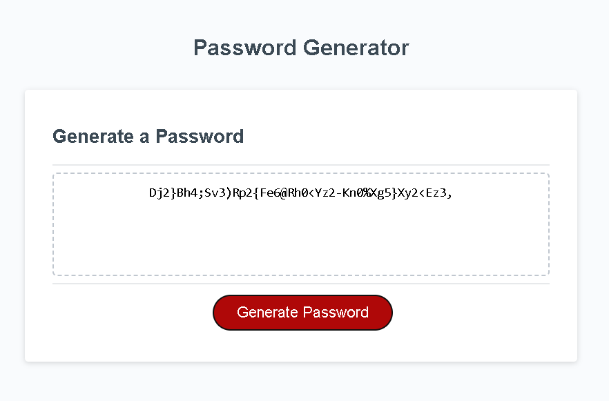

# password-generator
The password generator will generate a password with the size and content you specify.

## Description
This password generator will prompt you for the following to generate a password:

How many characters would you like in your password (min = 8; max = 128)?
Would you like uppercase letters in your password?
Would you like lowercase letters in your password?
Would you like single-digit numbers in your password?
Would you like special characters in your password?

Given this information, the password generator will generate a password of your specified length with letters, numbers and special characters randomly generated and built into your password. The password will be output to your screen.

## User Story
AS AN employee with access to sensitive data

I WANT to randomly generate a password that meets certain criteria

SO THAT I can create a strong password that provides greater security

### Acceptance Criteria
GIVEN I need a new, secure password

WHEN I click the button to generate a password

THEN I am presented with a series of prompts for password criteria

WHEN prompted for password criteria

THEN I select which criteria to include in the password

WHEN prompted for the length of the password

THEN I choose a length of at least 8 characters and no more than 128 characters

WHEN asked for character types to include in the password

THEN I confirm whether or not to include lowercase, uppercase, numeric, and/or special characters

WHEN I answer each prompt

THEN my input should be validated and at least one character type should be selected

WHEN all prompts are answered

THEN a password is generated that matches the selected criteria

WHEN the password is generated

THEN the password is either displayed in an alert or written to the page

### Mock Up
Screenshot of the website with a password generated.

## Installation/Execution
https://vdunlop.github.io/portfolio/

There are 4 navigation items in the website's header. When they are selected, the website should respond as follows:

About Me - your view will move to the section titled About Me

Work - your view will move to the section titled Work

Contact Me - your view will move to the section titled Contact Me

Resume - you will be brought to a .pdf version of my resume

Each image links to a project in the specified language listed.

Contact information for Vicki is included at the bottom of this Portfolio.

## Usage
When you open the portfolio window, you will be able to navigate to the sections below the main image by selecting the navigation items at the top of the page.

You will be able to view Vicki's current resume, as well as her LinkedIn page. 

Vicki's most current projects are highlighted first. Click on the image.

Archived projects are listed below the current project images.

Vicki's most current contact information is at the bottom of the screen.

## Credits

N/A

## License

N/A
